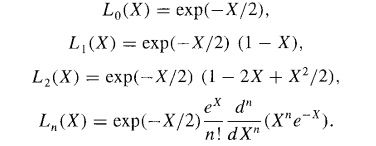
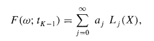

# Optimal-Stopping
Here, I have done experiments with LSM (Least Square Monte- Carlo Approach) of solving the Optimal Stopping Problems. 
Below are the LSM Equations. 
 
 
 

# Results 
1. Languerre Gaussian Research - All results and experiments stored in Languerre Gaussian Research.pdf. It takes <a href ="https://en.wikipedia.org/wiki/Laguerre_polynomials">Languerre Polynomials</a> as the basis function.
2. Simple Gaussian Research - All results and experiments stored in Simple Gaussian_research.pdf. It takes Simple Polynomials as the basis function.

# Additional work 
In the stock_model.py, I have kept a option where one can add noises to the stock prices by keeping noise=True. Keeping logstaff=True, we can form exactly the same array as shown in Longstaff and Swartz paper.  
Different type of basis functions like simple polynomial, Languerre Polynomial and Languerre Time polynomial are there in basis_function.py
