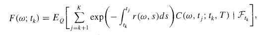
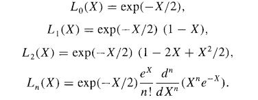

# Optimal-Stopping
Here, I have done experiments with LSM (Least Square Monte- Carlo Approach) of solving the Optimal Stopping Problems. 
Below are the LSM Equations. 
 
 
 

# Results 
1. Languerre Gaussian Research - All results and experiments stored in Languerre Gaussian Research.pdf. It takes <a href ="https://en.wikipedia.org/wiki/Laguerre_polynomials">Languerre Polynomials</a> as the basis function.
2. Simple Gaussian Research - All results and experiments stored in Simple Gaussian_research.pdf. It takes Simple Polynomials as the basis function.

However, in the files one can find other functions also. Like - 
